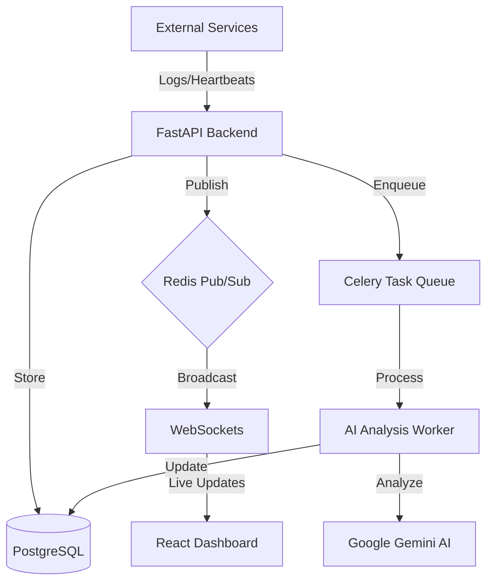

# 🛰️ Sentinel AI: Real-Time Incident Analyzer

Sentinel AI is a modern, full-stack observability platform that uses AI to detect anomalies, track incidents, and perform deep root-cause analysis in real-time. 

Built with a high-performance **FastAPI** backend, a **React** glassmorphism dashboard, and **Gemini AI** for automated diagnostics.


## 🚀 Features

*   **Real-Time Log Streaming**: Instant WebSocket-based log ingestion and visualization.
*   **AI Root Cause Analysis**: Automated incident diagnostics using Google Gemini (Flash).
*   **Anomaly Detection**: Automatic incident creation based on error thresholds and service heartbeats.
*   **Service Monitoring**: Real-time health tracking across multiple microservices.
*   **Modern UI**: High-performance, glassmorphism-themed dashboard built with Vite and Tailwind/CSS.
*   **Self-Healing Architecture**: Celery-based worker with automatic retries for resilient AI processing.

## 🛠️ Tech Stack

*   **Backend**: Python 3.11, FastAPI, SQLAlchemy (Async), PostgreSQL.
*   **Frontend**: React 18, TypeScript, Vite, Zustand (State Management), Lucide Icons.
*   **Messaging & Caching**: Redis (Pub/Sub & Task Queue).
*   **Worker**: Celery (Background Tasks).
*   **AI**: Google Gemini AI (Generative Language API).
*   **Orchestration**: Docker & Docker Compose.

## 🏗️ Architecture



## 🚦 Getting Started

### Prerequisites
*   Docker & Docker Compose
*   Gemini API Key (Get one at [aistudio.google.com](https://aistudio.google.com/))

### 1. Setup Environment
Create a `.env` file in the root directory:
```bash
GEMINI_API_KEY=your_api_key_here
```

### 2. Launch the Stack
```bash
docker compose up -d --build
```

The services will be available at:
*   **Dashboard**: `http://localhost:5173`
*   **Backend API**: `http://localhost:8000`
*   **API Docs**: `http://localhost:8000/docs`

### 3. Simulate Activity
To see the system in action, run the included simulation script:
```bash
python3 scripts/simulate_activity.py
```

## 🔒 Security & Resilience

*   **API Key Auth**: Services must authenticate with unique keys to send logs.
*   **Rate Limiting**: Integrated Redis-based sliding window rate limiter.
*   **Persistence**: Docker volumes ensure data survives system restarts.
*   **Healthchecks**: Automated monitoring and auto-restart policies for all containers.

## 📄 License
MIT License - Copyright (c) 2026 Sentinel AI Team
